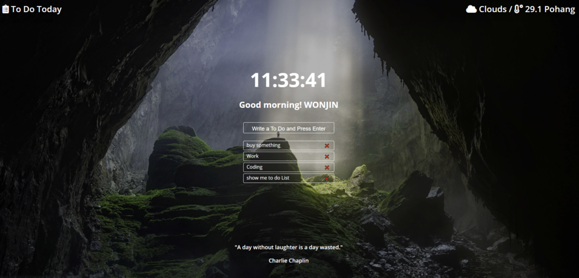

# Scheduler Web

### Project

- 프로젝트 : Scheduler App
- 언어 : HTML, CSS, JavaScript
- 기간 : 21.06.10 ~ 06.27

### 주요 기능

1. 실시간으로 초단위 시간을 보여준다.
2. openweathermap API를 이용해서 실시간으로 지역과 날씨, 온도 데이터를 받아와서 화면 상단에 렌더링한다.
3. 로그인 후 to do List를 작성할 수 있다.

### Scheduler Web [Click here](https://won-jin-lee.github.io/VanillaJS-Project/)

### Screen Shot

| Login  |                photo                |
| :----: | :---------------------------------: |
| before |  |

|       |                                        |
| :---: | :------------------------------------: |
| after |  |

---

### VanillaJS

- VanillaJS는 자바스크립트의 한 종류로 **Library, Framework** 가 없는 Javascript이다.

### var, let, const 키워드 차이점

| Keyword | Description                                                    |
| :-----: | :------------------------------------------------------------- |
|   var   | 같은 네임으로 두 변수를 선언이 가능함, 그 변수에 재할당을 한다 |
|   let   | 같은 이름으로 선언하면 에러가 발생, 하지만 재할당은 가능하다   |
|  const  | 같은 이름으로 선언하면 에러가 발생하고 재할당도 불가능하다     |
